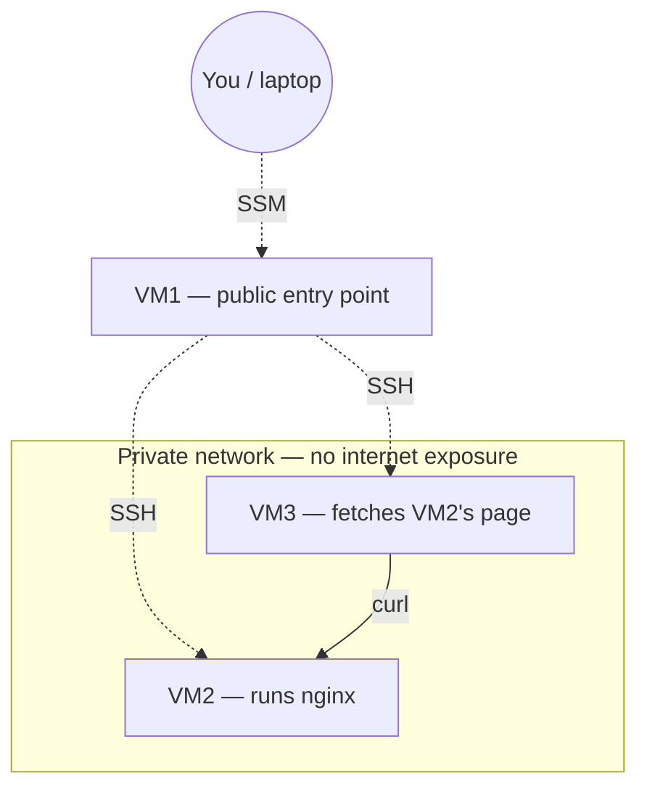

# Gate Check — Network Architecture

- VM1: only machine with a public IP. Accessed via SSM Session Manager — no port 22 exposed.
- VM2 & VM3: no public IP. SSH only accepted from VM1's private IP.
- NAT Gateway: gives VM2/VM3 outbound-only internet access for package installs, with zero inbound exposure.
- VM3 -> VM2: proves internal private-network connectivity without any internet exposure on either machine.

