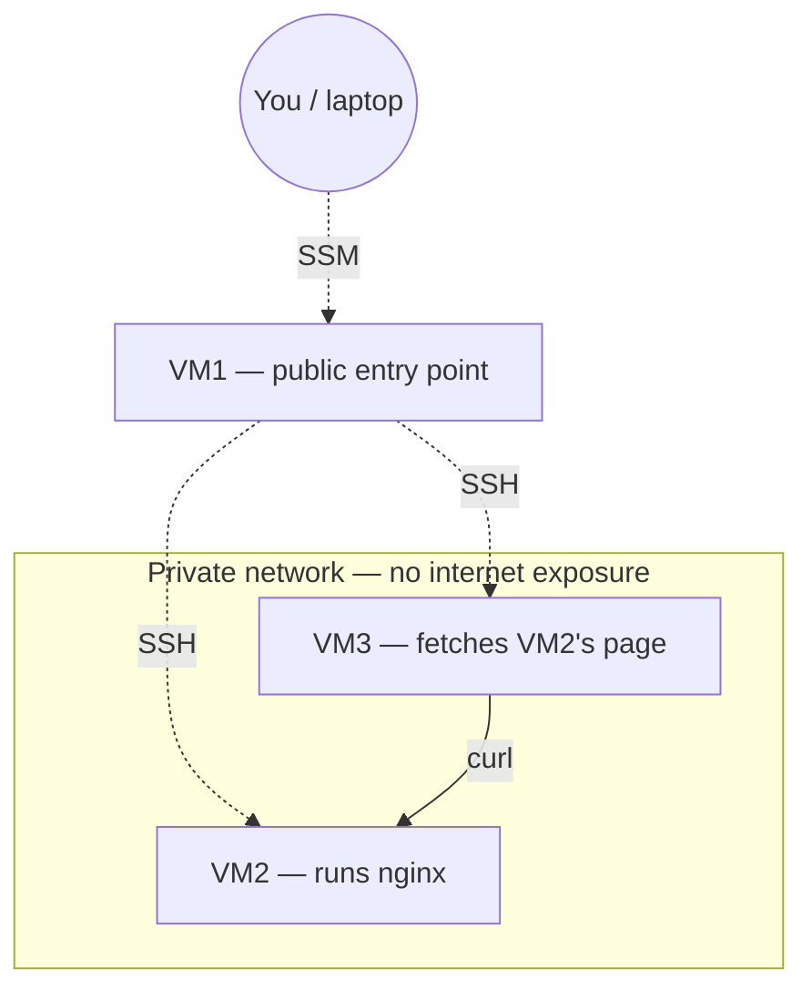
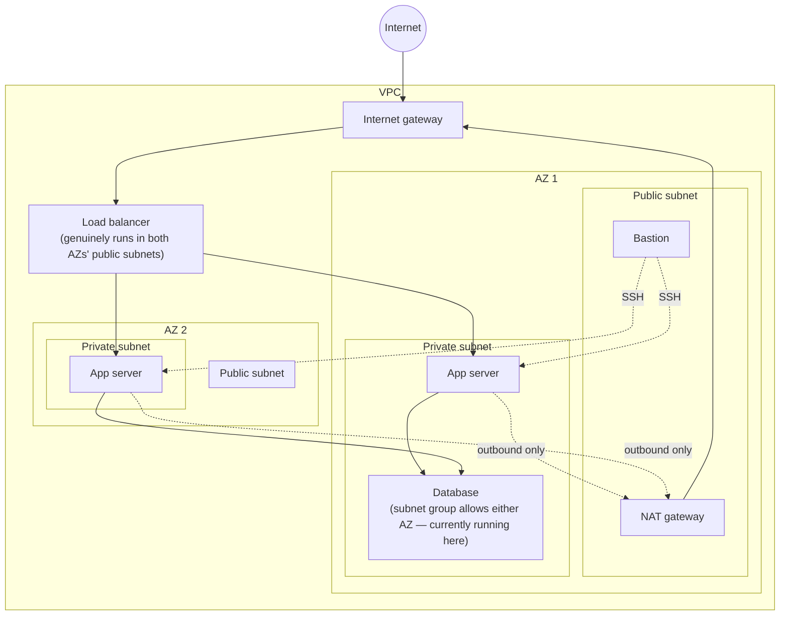
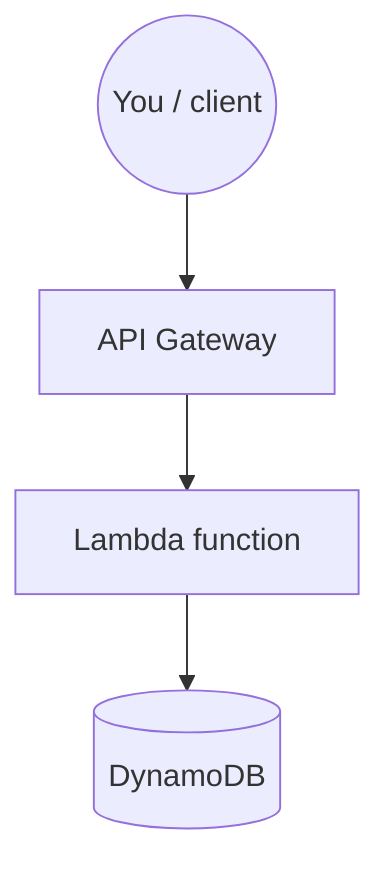
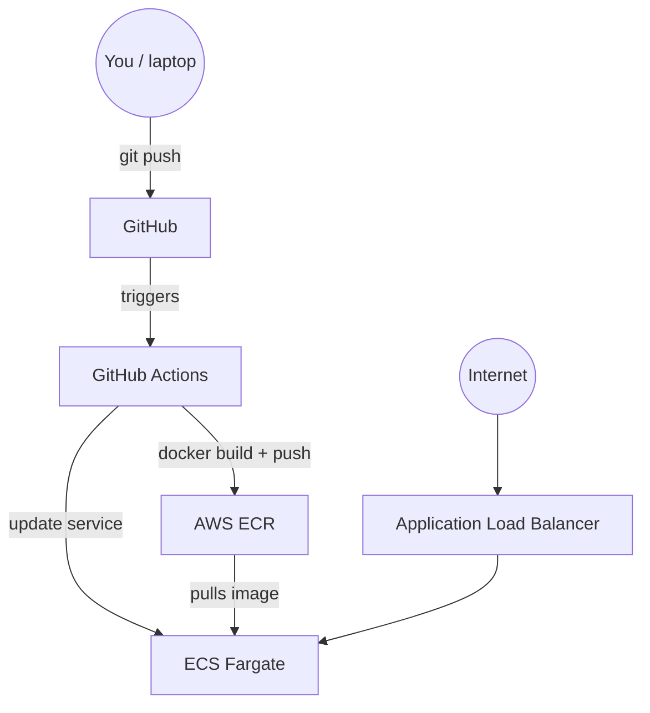

# Cloud DevOps Portfolio

Hands-on cloud infrastructure projects: AWS, Terraform, Kubernetes, CI/CD.

## Projects

| Stage | Description | Status |
|---|---|---|
| Gate check | 3-VM network: public entry point (VM1) + two fully private machines (VM2, VM3), NAT Gateway for outbound-only access, SSM-based access with zero open SSH ports, deliberate break/fix cycle | Complete |
| AWS CLI two-tier | Manual then scripted two-tier app | Complete |
| Terraform platform | Infrastructure as code (traditional VPC/EC2/RDS) | Complete |
| Serverless API (Terraform) | Lambda + API Gateway + DynamoDB, least-privilege IAM | Complete |
| CI/CD pipeline | GitHub Actions pipeline: PR triggers plan, merge triggers apply, OIDC auth | Complete |
| Containers & ECS | Docker, ECR, ECS Fargate, ALB, CI/CD pipeline | Complete |
| Kubernetes (node-based) | EKS platform — node-based cluster | Planned |
| Kubernetes (Fargate) | EKS platform — re-deployed on Fargate for comparison | Planned |
| Observability | Monitoring & SRE practices | Planned |

## Gate check — write-up

**Goal:** build a public entry point and two fully isolated private machines, prove they can communicate internally, and recover from an induced failure using logs alone.

**What was built:**
- VM1 (public): the only machine with a public IP. Accessed exclusively via AWS SSM Session Manager — no SSH port ever opened to the internet.
- VM2 & VM3 (private): no public IP at all. SSH access restricted to VM1's private IP only, via security group rules.

**Real issue hit and resolved:**
- Issue 1 — SSH to VM1 blocked:** initial SSH attempts to VM1 timed out consistently. Diagnosed methodically — verified the security group, route table, and instance health were all correct, then ruled out the network by testing over a different connection entirely. Isolated the cause to the laptop's own device-level policy blocking outbound SSH, regardless of network. Resolved by switching to SSM Session Manager, which uses HTTPS instead of SSH — arguably the more production-appropriate choice anyway, since it requires no open inbound port at all.

- Issue 2 — VM2 had no path to install packages:** package installs on VM2 failed with repository timeout errors. Root cause: a fully private subnet has no route to the internet by default, even though it must also stay unreachable from outside. Resolved by adding a NAT Gateway and routing the private subnet's outbound traffic through it — giving VM2 and VM3 outbound-only internet access with zero inbound exposure.

**Break/fix cycle:** stopped nginx on VM2 deliberately, diagnosed using `systemctl status`, `journalctl`, and `ss -tlnp` as if walking in cold, restarted it, and verified the fix from VM3 — the actual dependent machine — rather than from VM2 itself.

**Files:** see `00-fundamentals/` for setup scripts and the architecture diagram. `build-log.md` in particular documents the full connection setup, both key-related bugs, and the security group fix that let VM3 reach VM2 — details not captured in the scripts themselves.

## Stage 1 — Manual + CLI-Scripted Two-Tier Architecture

**Goal:** build a public ALB → private Auto Scaling Group → private RDS database, across 2 AZs, with a bastion host as the sole SSH entry point — first manually in the console, then rebuilt entirely from an AWS CLI script.

**What was built:** custom VPC, 4 subnets (2 public, 2 private) across 2 AZs, IGW + NAT Gateway, layered security groups (ALB → app → database, plus bastion), ALB with target group and Auto Scaling Group, RDS MySQL database (private only), and a bastion host — built once by hand, then torn down and rebuilt identically via a one-shot AWS CLI script.

**Verified end to end:** laptop → bastion → app server → database, confirmed working on both the manual and CLI-rebuilt versions.

**Real bugs hit and fixed:** an EC2 key pair got recreated under the same name but different underlying key material, causing persistent "Permission denied" errors; resolved by generating a fresh, dedicated key pair. The CLI-scripted security groups initially omitted the bastion→app-server SSH rule present in the manual build; found via a connection timeout, fixed by adding the missing rule.

**Torn down after verification** to stop billing — both the manual and CLI-built copies.

**Files:** see `01-aws-cli/deploy.sh` for the full one-shot rebuild script.

## Stage 2 — Infrastructure as Code (Terraform)

**Goal:** rebuild Stage 1's entire architecture declaratively using Terraform, with remote state, and prove that infrastructure defined in code remains the source of truth even after manual changes (drift detection).

**What was built:** the full Stage 1 architecture (VPC, 4 subnets across 2 AZs, IGW, NAT Gateway, route tables, 4 security groups, launch template, ALB, target group, listener, Auto Scaling Group, RDS database, bastion host) — all defined in `main.tf` and created via `terraform apply`.

**Remote state:** state stored in an S3 bucket with DynamoDB-based locking, instead of a local file — set up before any real infrastructure was written, so it was a habit from the first resource onward.

**Secrets handling:** the database password is supplied via a Terraform variable (`var.db_password`), with the real value kept in `terraform.tfvars` — excluded from version control via `.gitignore` — rather than hardcoded into the pushed configuration.

**Real bug diagnosed and fixed:** after building the bastion, hopping from it into the private app servers timed out despite every inbound rule, key, NACL, and instance health check confirming correct. Ruled out each layer systematically before finding the actual cause: the bastion's *outbound* security group rule had been scoped to a single stale IP address instead of allowing all outbound traffic — meaning the bastion could receive connections but not initiate any. Fixed by correcting the egress rule to `0.0.0.0/0`, re-applying, and reconfirming the full chain.

**Drift detection:** manually edited a security group rule's description directly in the AWS console, then ran `terraform plan`, which correctly detected the change as drift. Ran `terraform apply` to revert AWS back to match the Terraform configuration — confirming code, not console state, is the source of truth.

**Verified end to end:** laptop → bastion → app server → database, successfully connected via the Terraform-built infrastructure.

**Files:** see `02-terraform/main.tf` and `02-terraform/variables.tf` for the full configuration.

## Stage 2b — Serverless API; Terraform (Lambda + API Gateway + DynamoDB)

**Goal:** build a small, fully working web API with no servers to manage — proving understanding of the serverless pattern and applying the same least-privilege IAM discipline used in every previous stage.

**What was built:** a DynamoDB table (pay-per-request), a Python Lambda function using Boto3 to read/write it, an IAM role scoped to exactly two actions (`PutItem`, `GetItem`) on exactly one table, and an HTTP API Gateway wired to trigger the function — all defined and deployed via Terraform.

**Real bug diagnosed and fixed:** initial requests returned a generic "Internal Server Error" with no obvious cause. Diagnosed methodically — confirmed the Lambda permission, the API Gateway integration, and the route were all correctly configured, then invoked Lambda directly (bypassing API Gateway) to isolate the failure to one specific layer. Direct invocation succeeded, proving the Lambda code and IAM permissions were correct — narrowing the bug to how API Gateway was formatting the request. Root cause: a mismatch between the integration's `payload_format_version` (set to 2.0) and the Lambda code, which was written expecting version 1.0's event shape (`event['httpMethod']` at the top level, rather than version 2.0's nested `event['requestContext']['http']['method']`). Fixed by aligning the integration to `payload_format_version = "1.0"`.

**Verified end to end:** POST request saves an item to DynamoDB; GET request fetches that same item back — confirmed via `curl` against the live API endpoint.

**Files:** see `02b-serverless-terraform/main.tf` for the full Terraform configuration and `02b-serverless-terraform/lambda/handler.py` for the function code.

## Stage 3 — CI/CD Pipeline (GitHub Actions + Terraform)

**Goal:** replace manual `terraform apply` runs with an automated pipeline — every infrastructure change reviewed via pull request, planned automatically, and only applied after a deliberate merge to main.

**What was built:** a GitHub Actions pipeline (`.github/workflows/deploy.yml`) that triggers on pull requests and pushes to main, scoped to the `02-terraform/` folder. Pull requests automatically run `terraform plan` and post the output as a PR comment. Merges to main automatically run `terraform apply`. Authentication uses OIDC — no AWS keys stored anywhere; GitHub issues a one-time token per run, AWS verifies it against a trust policy scoped to this repo, and issues temporary credentials.

No one touches AWS directly. No one runs Terraform locally against production. Every change is reviewed, logged, and traceable in Git history.

**Pipeline triggers:**
- Pull request touching `02-terraform/**` → runs `terraform plan`, posts output as PR comment
- Push to `main` touching `02-terraform/**` → runs `terraform apply`

**Key design decision:** `continue-on-error: true` on the plan step means plan failures still post to the PR comment, so reviewers see the error rather than just a failed check.

**Real bugs diagnosed and fixed:**

1. OIDC authentication failure — GitHub OIDC tokens for organization accounts include numeric IDs in the `sub` claim (`repo:Duna-Devo@311078967/Cloud-devops-portfolio@1317381594:pull_request`). Fixed by broadening the trust policy condition to `repo:Duna-Devo*:*`.

2. Stale S3 backend — original AWS account closed (free tier expired). New account had no state bucket. `terraform init` failed with a 403. Fixed by creating a new S3 bucket and updating the backend config in `main.tf`.

3. Missing `db_password` variable — Terraform hung waiting for interactive input in the pipeline. Fixed by storing the password as a GitHub Actions secret (`TF_VAR_db_password`) and exposing it via the job `env` block.

4. New-account EC2 security hold — AWS temporarily blocked EC2 launches on the new account pending automated security validation. Cleared naturally.

**Plan review gate verified:** opened a PR with a harmless comment change, confirmed the pipeline automatically posted a "No changes" plan comment, reviewed it, then merged deliberately — proving the full safety flow works as designed.

**Break/catch exercise:** introduced an intentional invalid RDS instance type (`db.invalid.type`). Pipeline ran plan and posted the change to the PR comment. Key lesson: `terraform plan` surfaces what would change but some invalid values are only rejected during `apply`. Human review of the plan output is essential, not optional.

**Key takeaways:**
- OIDC eliminates stored AWS credentials entirely — credentials are ephemeral, scoped to each pipeline run
- The pipeline enforces process: plan before apply, review before merge, no manual shortcuts
- `terraform plan` is a visibility tool, not a complete validator — human review matters
- Real bugs in CI/CD setup are normal; diagnosing them methodically is the job

**Infrastructure deployed:** full Stage 2 architecture (VPC, public/private subnets, NAT Gateway, ALB, ASG, RDS MySQL, bastion host) — all provisioned via the automated pipeline, not manually.

**Teardown:** terraform destroy timed out multiple times due to resource dependency 
ordering failures — ASG drain timeout, RDS still running, ALB listener blocking 
target group deletion, NAT Gateway holding an Elastic IP that blocked IGW detachment. 
Each blocker was cleared manually via AWS CLI in dependency order: RDS → ALB listener 
→ target group → security groups → NAT Gateway → EIP → IGW → subnets → route tables 
→ VPC. Root cause: partial state mismatch between Terraform's state file and actual 
AWS resources after the first failed destroy attempt.

**Files:** see `.github/workflows/deploy.yml` for the pipeline definition.

## Stage 4 — Containerization & ECS Deployment

**Goal:** containerize a Flask application using Docker, store the image in AWS ECR, deploy it to ECS Fargate behind an Application Load Balancer, and automate the entire build-push-deploy cycle with a GitHub Actions CI/CD pipeline.

**What was built:** a Flask app with two endpoints (`/` and `/health`), containerized using a Python 3.13-slim base image. The image is stored in ECR and runs on ECS Fargate — no servers to manage. An Application Load Balancer sits in front of the service providing a fixed DNS name, health checks, and zero-downtime rolling deployments. A GitHub Actions pipeline triggers on every push to `main` that touches `04-containers/`, automatically building a new image tagged with the commit SHA, pushing it to ECR, and deploying it to ECS.

**Real bugs hit and fixed:**

1. Security group misconfiguration — deployed the ECS service with an empty security group (`securityGroups=[]`), falling back to the default which blocks all inbound internet traffic. Curl requests timed out after 21 seconds with no connection rather than an immediate refusal — the signature of traffic being silently dropped at the network level rather than actively rejected. Fixed by adding an inbound rule opening port 5000 to `0.0.0.0/0` on the default security group.

2. Pipeline action versions deprecated — initial pipeline used `actions/checkout@v3`, `configure-aws-credentials@v2`, and `amazon-ecr-login@v1`, all targeting Node.js 20. GitHub Actions runners upgraded to Node.js 24, causing the pipeline to fail. Fixed by upgrading all actions to their latest versions.

3. Task definition not found — the deploy action expected a local file called `stage4-task` in the repo. The task definition lives in AWS, not as a file. Fixed by adding a step to download the task definition from AWS using `aws ecs describe-task-definition`, inject the new image into it, then deploy the updated file.

4. CodeDeploy controller lock — recreated the ECS service with `--deployment-controller type=CODE_DEPLOY` for blue/green support, which locked the service so only CodeDeploy could trigger deployments. CodeDeploy requires full AWS account activation which was pending. Fixed by deleting and recreating the service with the default rolling deployment controller while keeping the ALB attached.

5. IP address changes on redeployment — ECS assigns a new public IP every time a task is replaced. Fixed permanently by adding an Application Load Balancer — the ALB DNS name never changes regardless of how many times the container is replaced.

**Verified end to end:** pushed a code change, pipeline triggered automatically, new image built with commit SHA tag, pushed to ECR, ECS updated with new task definition revision, container restarted with zero downtime, ALB DNS name returned updated version — confirmed via curl.

**Live URL:** http://stage4-alb-188309003.us-east-1.elb.amazonaws.com

**Files:** see `04-containers/app/` for the Flask app, Dockerfile, and requirements. See `.github/workflows/container-deploy.yml` for the pipeline definition.

**Teardown:** deleted resources in dependency order — ECS service scaled to zero then deleted, ECS cluster deleted, ALB listener deleted before target groups (listener holds a reference to the target group; deleting out of order returns a ResourceInUse error), Blue and Green target groups deleted, ECR repository force-deleted including all images, IAM access key deleted before IAM user (AWS blocks user deletion until all access keys are removed), IAM role and attached policies deleted, ALB security group deleted. Root cause of most teardown errors: resources that reference other resources must be removed before the thing they reference.
