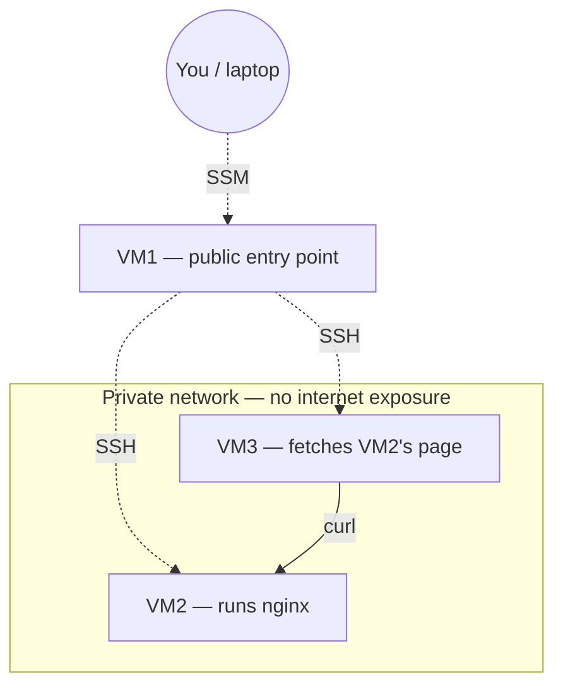
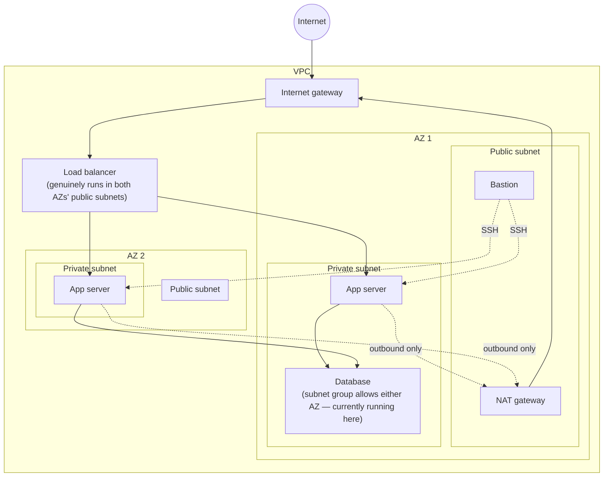
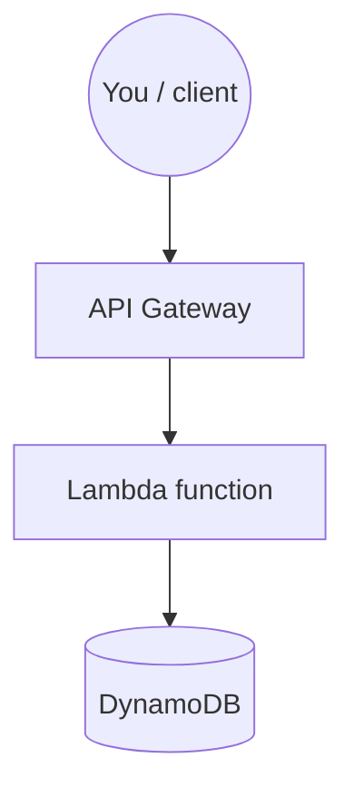

# Cloud DevOps Portfolio

Hands-on cloud infrastructure projects: AWS, Terraform, Kubernetes, CI/CD.

## Projects

| Stage | Description | Status |
|---|---|---|
| Gate check | 3-VM network: public entry point (VM1) + two fully private machines (VM2, VM3), NAT Gateway for outbound-only access, SSM-based access with zero open SSH ports, deliberate break/fix cycle | Complete |
| AWS CLI two-tier | Manual then scripted two-tier app | Complete |
| Terraform platform | Infrastructure as code | Complete |
| Serverless API  | Lambda + API Gateway + DynamoDB, least-privilege IAM, deployed via Terraform | Complete |
| CI/CD pipeline | Containerized deploy pipeline | Planned |
| Kubernetes | EKS platform | Planned |
| Observability | Monitoring & SRE practices | Planned |

## Gate check — write-up

**Goal:** build a public entry point and two fully isolated private machines, prove they can communicate internally, and recover from an induced failure using logs alone.

**What was built:**
- VM1 (public): the only machine with a public IP. Accessed exclusively via AWS SSM Session Manager — no SSH port ever opened to the internet.
- VM2 & VM3 (private): no public IP at all. SSH access restricted to VM1's private IP only, via security group rules.

**Real issue hit and resolved:**
- Issue 1 — SSH to VM1 blocked:** initial SSH attempts to VM1 timed out consistently. Diagnosed methodically — verified the security group, route table, and instance health were all correct, then ruled out the network by testing over a different connection entirely. Isolated the cause to the laptop's own device-level policy blocking outbound SSH, regardless of network. Resolved by switching to SSM Session Manager, which uses HTTPS instead of SSH — arguably the more production-appropriate choice anyway, since it requires no open inbound port at all.

- Issue 2 — VM2 had no path to install packages:** package installs on VM2 failed with repository timeout errors. Root cause: a fully private subnet has no route to the internet by default, even though it must also stay unreachable from outside. Resolved by adding a NAT Gateway and routing the private subnet's outbound traffic through it — giving VM2 and VM3 outbound-only internet access with zero inbound exposure.

**Break/fix cycle:** stopped nginx on VM2 deliberately, diagnosed using `systemctl status`, `journalctl`, and `ss -tlnp` as if walking in cold, restarted it, and verified the fix from VM3 — the actual dependent machine — rather than from VM2 itself.

**Files:** see `00-fundamentals/` for setup scripts and the architecture diagram. `build-log.md` in particular documents the full connection setup, both key-related bugs, and the security group fix that let VM3 reach VM2 — details not captured in the scripts themselves.

## Stage 1 — Manual + CLI-Scripted Two-Tier Architecture

**Goal:** build a public ALB → private Auto Scaling Group → private RDS database, across 2 AZs, with a bastion host as the sole SSH entry point — first manually in the console, then rebuilt entirely from an AWS CLI script.

**What was built:** custom VPC, 4 subnets (2 public, 2 private) across 2 AZs, IGW + NAT Gateway, layered security groups (ALB → app → database, plus bastion), ALB with target group and Auto Scaling Group, RDS MySQL database (private only), and a bastion host — built once by hand, then torn down and rebuilt identically via a one-shot AWS CLI script.

**Verified end to end:** laptop → bastion → app server → database, confirmed working on both the manual and CLI-rebuilt versions.

**Real bugs hit and fixed:** an EC2 key pair got recreated under the same name but different underlying key material, causing persistent "Permission denied" errors; resolved by generating a fresh, dedicated key pair. The CLI-scripted security groups initially omitted the bastion→app-server SSH rule present in the manual build; found via a connection timeout, fixed by adding the missing rule.

**Torn down after verification** to stop billing — both the manual and CLI-built copies.

**Files:** see `01-aws-cli/deploy.sh` for the full one-shot rebuild script.

## Stage 2 — Infrastructure as Code (Terraform)

**Goal:** rebuild Stage 1's entire architecture declaratively using Terraform, with remote state, and prove that infrastructure defined in code remains the source of truth even after manual changes (drift detection).

**What was built:** the full Stage 1 architecture (VPC, 4 subnets across 2 AZs, IGW, NAT Gateway, route tables, 4 security groups, launch template, ALB, target group, listener, Auto Scaling Group, RDS database, bastion host) — all defined in `main.tf` and created via `terraform apply`.

**Remote state:** state stored in an S3 bucket with DynamoDB-based locking, instead of a local file — set up before any real infrastructure was written, so it was a habit from the first resource onward.

**Secrets handling:** the database password is supplied via a Terraform variable (`var.db_password`), with the real value kept in `terraform.tfvars` — excluded from version control via `.gitignore` — rather than hardcoded into the pushed configuration.

**Real bug diagnosed and fixed:** after building the bastion, hopping from it into the private app servers timed out despite every inbound rule, key, NACL, and instance health check confirming correct. Ruled out each layer systematically before finding the actual cause: the bastion's *outbound* security group rule had been scoped to a single stale IP address instead of allowing all outbound traffic — meaning the bastion could receive connections but not initiate any. Fixed by correcting the egress rule to `0.0.0.0/0`, re-applying, and reconfirming the full chain.

**Drift detection:** manually edited a security group rule's description directly in the AWS console, then ran `terraform plan`, which correctly detected the change as drift. Ran `terraform apply` to revert AWS back to match the Terraform configuration — confirming code, not console state, is the source of truth.

**Verified end to end:** laptop → bastion → app server → database, successfully connected via the Terraform-built infrastructure.

**Files:** see `02-terraform/main.tf` and `02-terraform/variables.tf` for the full configuration.

## Stage 3b — Serverless API (Lambda + API Gateway + DynamoDB)

**Goal:** build a small, fully working web API with no servers to manage — proving understanding of the serverless pattern and applying the same least-privilege IAM discipline used in every previous stage.

**What was built:** a DynamoDB table (pay-per-request), a Python Lambda function using Boto3 to read/write it, an IAM role scoped to exactly two actions (`PutItem`, `GetItem`) on exactly one table, and an HTTP API Gateway wired to trigger the function — all defined and deployed via Terraform.

**Real bug diagnosed and fixed:** initial requests returned a generic "Internal Server Error" with no obvious cause. Diagnosed methodically — confirmed the Lambda permission, the API Gateway integration, and the route were all correctly configured, then invoked Lambda directly (bypassing API Gateway) to isolate the failure to one specific layer. Direct invocation succeeded, proving the Lambda code and IAM permissions were correct — narrowing the bug to how API Gateway was formatting the request. Root cause: a mismatch between the integration's `payload_format_version` (set to 2.0) and the Lambda code, which was written expecting version 1.0's event shape (`event['httpMethod']` at the top level, rather than version 2.0's nested `event['requestContext']['http']['method']`). Fixed by aligning the integration to `payload_format_version = "1.0"`.

**Verified end to end:** POST request saves an item to DynamoDB; GET request fetches that same item back — confirmed via `curl` against the live API endpoint.

**Files:** see `03b-serverless/main.tf` for the full Terraform configuration and `03b-serverless/lambda/handler.py` for the function code.
